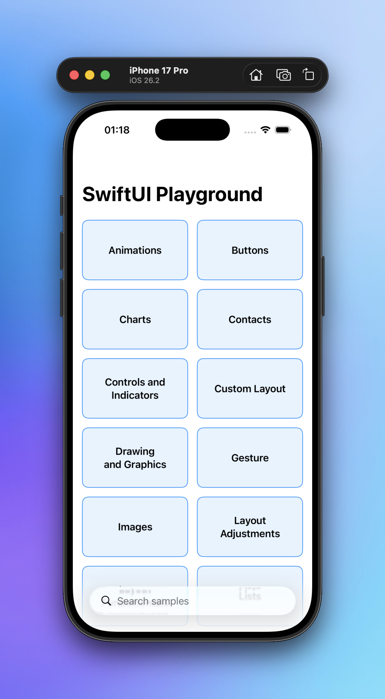

# SwiftUI Playground

> [!NOTE]
> This is a collection of Swift/SwiftUI samples. It includes code snippets, examples, and exercises that I have collected from various sources and created myself.
> I have created this repository to help me learn Swift and SwiftUI. I hope it will be useful to others as well.

### Minimum Deployments Requirements
- iOS: 26.0
- iPadOS: 26.0
- macOS: 26.0
- visionOS: 26.0

### Preview

### Credits and References
- [Enid](https://x.com/ios_dev_alb)
- [JunoSlider](https://github.com/christianselig/JunoSlider)
- [Alberto Moral](https://x.com/AlbertMoral)
- [Hacking with Swift](https://www.hackingwithswift.com/)
- [Natalia Panferova](https://x.com/natpanferova)
