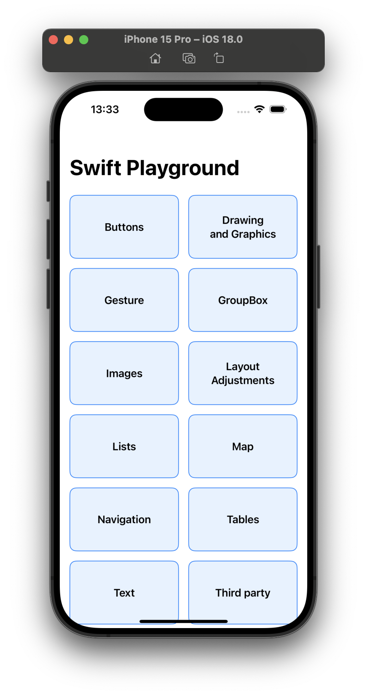
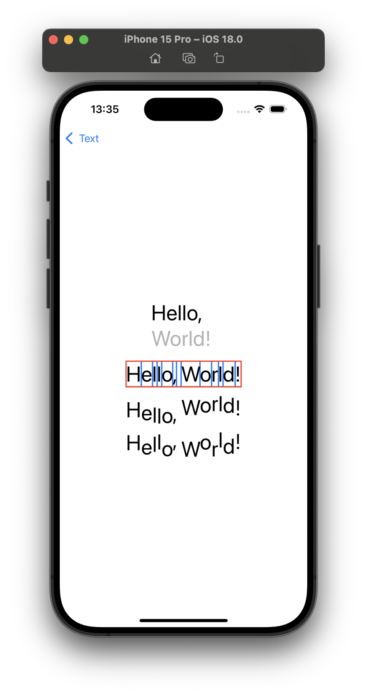

# Swift Playground

> [!NOTE]
> This is a collection of Swift/SwiftUI samples. It includes code snippets, examples, and exercises that I have collected from various sources and created myself.
> I have created this repository to help me learn Swift and SwiftUI. I hope it will be useful to others as well.

### Preview

|  Samples List | Sample Preview |
| --------------- | --------------- |
|  |  |

### Credits and References
- [Enid](https://x.com/ios_dev_alb)
- [JunoSlider](https://github.com/christianselig/JunoSlider)
